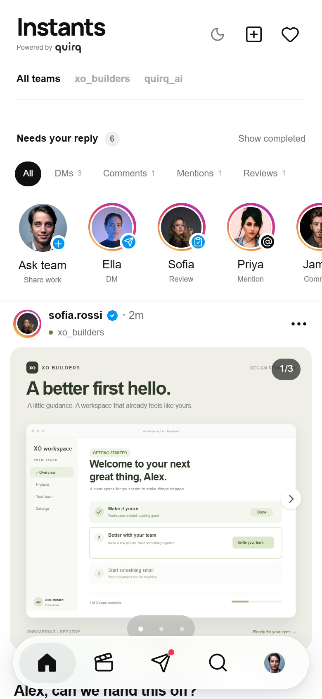
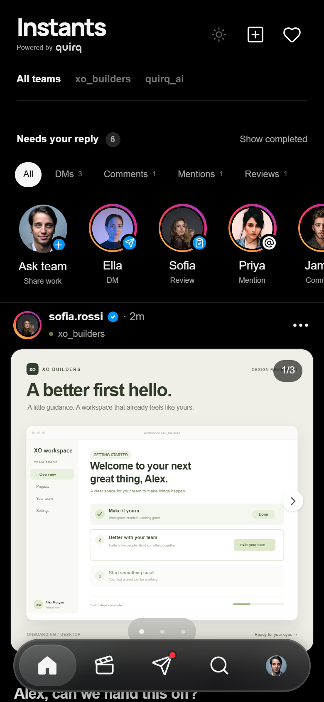
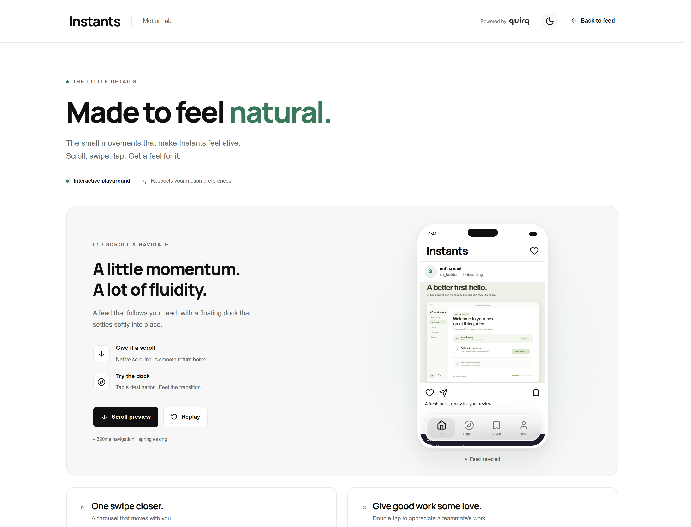
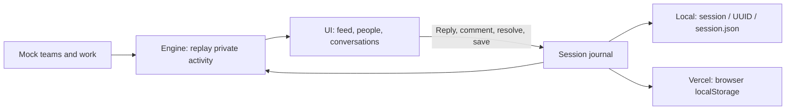
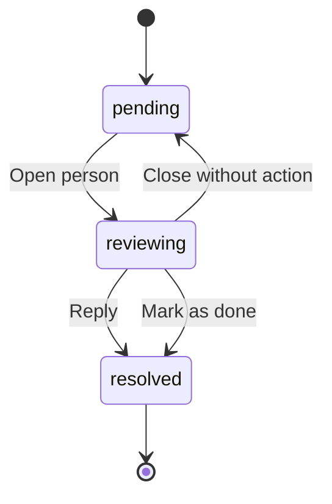

# Instants

**Work that needs a reply. People you can see.**

A collaboration prototype for teams sharing work, testing ideas, and getting timely feedback. The example feed follows **xo_builders** and **quirq_ai**. A categorized attention rail brings the people waiting on your reply to the top, while a small private activity journal keeps your own progress between visits. Built with React, TypeScript, and Next.js, with JSON branding, light/dark themes, and native scrolling.

[Get started](#run-locally) · [Motion](#motion-and-gestures) · [Architecture](#architecture) · [Contribute](CONTRIBUTING.md) · [MIT license](LICENSE)

<p align="center">
  
  
</p>

<p align="center">The mobile feed in light and dark themes.</p>

## What you can try

- **Team work feed:** designs, build checks, test requests, and decisions from `xo_builders` and `quirq_ai`, with quick responses and comments.
- **People who need you:** the **Needs your reply** rail groups pending DMs, comments, mentions, and reviews. Open a person, read the context, and reply or resolve.
- **Private progress:** likes, saves, replies, comments, and other supported activity rebuild from a simple session journal. Export it as JSON for inspection or backup.
- **Create and share:** select a photo, add context, create an instant, or share work into a demo conversation. Seeded posts support links such as `/?post=p1`.
- **A complete UI journey:** photo carousels, Explore, account search, profiles, saved posts, comments, and demo conversations.
- **Responsive navigation:** desktop sidebar, tablet rail, and a floating mobile glass dock.
- **Motion you can inspect:** touch and mouse gestures, scroll restoration, press feedback, and a dedicated `/motion` playground using shared primitives and tokens.

This is a private-session prototype with sample accounts and conversations. Replies update your demo state; they are not sent to real teammates. There is no sign-in, team synchronization, or account connection. Local development stores activity in `session/<UUID>/session.json`; Vercel keeps the same journal in your browser. Reels use labeled still-photo previews; account switching and calls are presentation-only.

## Run locally

Use **Node.js 22.13 or newer** and npm.

```sh
git clone https://github.com/quirq-ai/instants.git
cd instants
npm ci
npm run dev
```

Open [localhost:5180](http://localhost:5180) for the app or [localhost:5180/motion](http://localhost:5180/motion) for the motion playground. No API keys or environment variables are required for the demo.

| Command             | Purpose                                           |
| ------------------- | ------------------------------------------------- |
| `npm run dev`       | Start the Next.js development server on port 5180 |
| `npm run lint`      | Check source with ESLint                          |
| `npm run typecheck` | Check TypeScript without emitting files           |
| `npm test`          | Run the Node unit tests                           |
| `npm run test:e2e`  | Run the Playwright browser tests                  |
| `npm run build`     | Create the Next.js production build in `.next`    |
| `npm start`         | Serve the production build on port 5180           |

Before the first browser test run, install its browser with `npx playwright install chromium`. On Linux, CI may also need Playwright's system dependencies: `npx playwright install --with-deps chromium`.

The default development, build, and production commands use standard Next.js. The optional Sites scaffold has separate `dev:sites`, `build:sites`, and `start:sites` commands; it is not needed to run locally or deploy to Vercel. See [architecture](docs/architecture.md#build-and-hosting-boundary) for that boundary.

## Deploy to Vercel

Import `quirq-ai/instants` into Vercel with the repository root (`.`) as the **Root Directory**. The repository itself is the app; do not enter `instagram-ui` as a subdirectory. Use Node.js 22.x. No API keys or environment variables are required for this frontend demo.

The committed [vercel.json](vercel.json) defines the deployment settings:

| Setting          | Value           |
| ---------------- | --------------- |
| Framework        | Next.js         |
| Install command  | `npm ci`        |
| Build command    | `npm run build` |
| Output directory | `.next`         |

Clear conflicting dashboard overrides from an earlier import, including any Vite, Vinext, `dist`, or Cloudflare build settings, so the project uses the checked-in configuration. Keep the Root Directory at `.`.

When the GitHub repository is connected to the Vercel project, a push to its production branch starts a deployment. For an existing failed deployment, deploy the latest commit after correcting the settings; rebuilding an older commit will still use its old scripts. Check the Vercel build logs to confirm the deployed revision and outcome.

## Motion and gestures

The motion system is a browser-based approximation of familiar social app interactions. Native touch and wheel scrolling retain platform momentum; JavaScript does not replace the page's scroll loop.

| Interaction             | Behavior                                                                                                          |
| ----------------------- | ----------------------------------------------------------------------------------------------------------------- |
| Feed                    | Native vertical scrolling; returning to a view restores its position                                              |
| Repeat Home             | Programmatic scroll to the top, respecting reduced motion                                                         |
| Photo carousel          | Native horizontal scroll snap, touch swipe, mouse drag, buttons, and keyboard controls                            |
| Attention request       | Swipe the header for previous/next or down to close; the conversation keeps native scrolling and visible controls |
| Press, like, navigation | Short CSS transitions and keyframes using shared durations and easing                                             |
| Reduced motion          | Suppresses decorative movement and avoids animated programmatic scrolling                                         |

Edit [config/motion.json](config/motion.json) for shared timings and gesture thresholds. [docs/motion.md](docs/motion.md) explains the contract, input behavior, reduced motion, and how to verify changes. Visit `/motion` to exercise the same building blocks outside the feed.

<p align="center">
  
</p>

[Watch the recorded motion demo (WebM)](docs/media/motion-demo.webm).

## Make it yours

| File                                     | Customize                                                                   |
| ---------------------------------------- | --------------------------------------------------------------------------- |
| [config/brand.json](config/brand.json)   | Name, logo, fonts, colors, light/dark tokens, radius, and mobile dock       |
| [config/motion.json](config/motion.json) | Durations, easing, and gesture thresholds                                   |
| [data/mock.json](data/mock.json)         | Companies, teammates, work, comments, conversations, and attention requests |
| [app/globals.css](app/globals.css)       | Layout and component styles                                                 |

Put local assets in `public/` and reference them with a leading `/`. Set `fontStylesheet` to an empty string to use local/system fonts. A saved theme overrides `defaultTheme`; clear the `ig-ui-theme` localStorage entry to test a new default. Production changes require a rebuild.

Each post can include an `instant` with a `kind` (`invite` or `poll`), `title`, `expiresInMinutes`, and response `options` containing `id`, `label`, and `count`. Seeded countdowns begin at the session's creation time. A new post's window begins at its creation event, so refreshing does not reset either deadline.

## Architecture

The code is organized around two responsibilities. **UI** owns the experience; **engine** owns the activity contract and persistence. Both ship in the same application.

| Section  | Documentation                                                                       |
| -------- | ----------------------------------------------------------------------------------- |
| UI       | [Surfaces, component diagram, request flow, themes, and motion](docs/ui.md)         |
| Engine   | [Session schema, event vocabulary, storage modes, and API sequence](docs/engine.md) |
| Overview | [Source map, runtime boundaries, and extension points](docs/architecture.md)        |



An attention request has a small lifecycle. A reply also updates its associated conversation or post comments; opening the request does not resolve it.



## Private session activity

Local development records actions in `session/<UUID>/session.json`, selected by an `HttpOnly` session cookie. The folder is ignored by Git. On Vercel, the journal is stored in browser localStorage under `instants-session-v1`; no database setup is required.

Each journal has `schemaVersion`, `id`, `userId`, `createdAt`, `updatedAt`, and an `activity` array. Each event is `{ id, type, at, data }`. A save is `post.save` with `{ postId, saved: true }`; a contextual reply is `queue.reply`. [The engine guide](docs/engine.md#a-small-session-folder) includes a complete JSON example and validation limits.

The UI distinguishes **Saved locally** from **Saved on this device**. Use **Export session** to download the journal as `instants-session-<UUID>.json`. Exports are manual backups, not a team sharing or import feature. Failed file saves retain pending events for retry and expose the export option.

## Privacy and project scope

Private means a separate browser session, not an authenticated person. A local server owner can read the plain JSON files; browser storage is scoped to the current browser profile and origin. Another person using the same browser profile can access the same demo state. There is no cross-device or shared team persistence.

Selected images can become part of a created post's private journal. In local file mode that journal is sent to your local server; on Vercel it remains in browser storage. Session data, pending saves, and downloaded JSON are unencrypted and should not be committed. Clearing site data can remove the hosted journal. Avoid treating the demo as your only copy of important work.

Remote photos and the configured Google Fonts stylesheet make requests to their respective providers; replace them with local assets for a self-contained demo. No integration sends demo replies to external accounts.

This project is independent of Instagram and Meta. It does not reproduce or claim access to their proprietary motion implementations.

## Contributing and license

Small, focused improvements are welcome. Read [CONTRIBUTING.md](CONTRIBUTING.md) for setup, checks, and review expectations, and [SECURITY.md](SECURITY.md) for reporting vulnerabilities privately.

Original project code is available under the [MIT license](LICENSE). Dependencies and vendored code retain their licenses. The Instants and Quirq names and logo assets, remote photography, and externally served fonts are not relicensed by this repository's MIT license. See [THIRD_PARTY_NOTICES.md](THIRD_PARTY_NOTICES.md) before reusing those assets.
