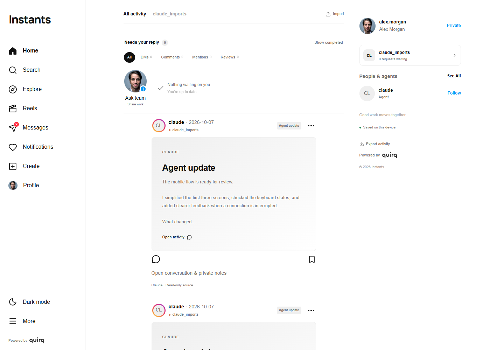
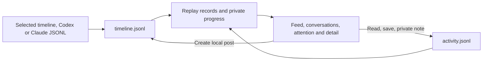
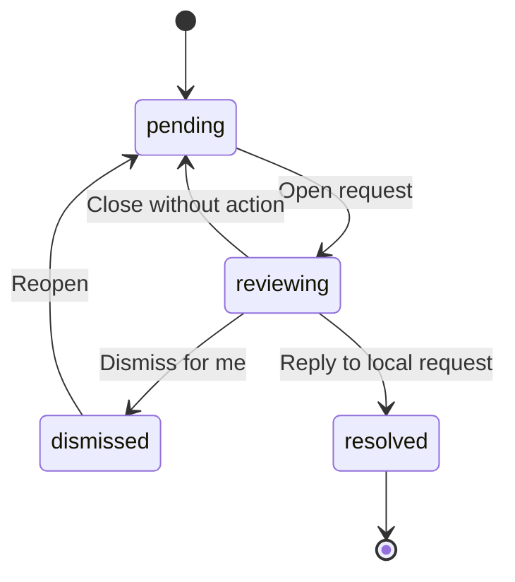

# Instants

**Your agent activity, in one place.**

A local visual workspace for agent activity. Import Codex or Claude conversations, or a normalized Instants timeline, and work through them as a feed. Two JSONL files hold everything: **`timeline.jsonl`** for feed data and **`activity.jsonl`** for your private progress. The original team examples remain available on a new profile. Built with React, TypeScript, and Next.js, with JSON branding, light/dark themes, and native scrolling.

[Get started](#run-locally) · [Motion](#motion-and-gestures) · [Architecture](#architecture) · [Contribute](CONTRIBUTING.md) · [MIT license](LICENSE)

<p align="center">
  
  
</p>

<p align="center">The example team feed in light and dark themes; imported activity uses the same layout.</p>

## What you can try

- **Import real history:** choose an Instants timeline, Codex conversation JSONL, or Claude conversation JSONL; merge it into the feed or replace the existing feed.
- **Read agent activity:** text cards, full detail, separate conversations, source context, searchable Explore, profiles, and optional visual previews.
- **Keep private progress:** opening a card records reading state; save it or add a private note. Export the timeline and activity separately.
- **Review requests:** the attention rail groups DMs, comments, mentions, and reviews. Read-only requests can be dismissed privately without resolving upstream work.
- **Try the team examples:** new profiles start with `xo_builders` and `quirq_ai` work, quick responses, conversations, and local creation.
- **Keep the familiar UI:** light/dark themes, carousels, desktop sidebar, floating mobile glass dock, and a `/motion` playground.

Imports are selected by you. Instants does not automatically scan `.agents` or connect to agent accounts, GitHub, or plugins. `.agents` is the conceptual collection of agent data, not a required folder. Imported native conversations are read-only; local/demo replies are never delivered to external applications. There is no authenticated team synchronization yet.

## Run locally

Use **Node.js 22.13 or newer** and npm.

```sh
git clone https://github.com/quirq-ai/instants.git
cd instants
npm ci
npm run dev
```

Open [localhost:5180](http://localhost:5180) for the app or [localhost:5180/motion](http://localhost:5180/motion) for the motion playground. No API keys or environment variables are required for the initial feed and selected-file imports.

| Command             | Purpose                                           |
| ------------------- | ------------------------------------------------- |
| `npm run dev`       | Start the Next.js development server on port 5180 |
| `npm run lint`      | Check source with ESLint                          |
| `npm run typecheck` | Check TypeScript without emitting files           |
| `npm test`          | Run the Node unit tests                           |
| `npm run test:e2e`  | Run the Playwright browser tests                  |
| `npm run build`     | Create the Next.js production build in `.next`    |
| `npm start`         | Serve the production build on port 5180           |

Before the first browser test run, install its browser with `npx playwright install chromium`. On Linux, CI may also need Playwright's system dependencies: `npx playwright install --with-deps chromium`.

The default development, build, and production commands use standard Next.js. The optional Sites scaffold has separate `dev:sites`, `build:sites`, and `start:sites` commands; it is not needed to run locally or deploy to Vercel. See [architecture](docs/architecture.md#build-and-hosting-boundary) for that boundary.

## Deploy to Vercel

Import `quirq-ai/instants` into Vercel with the repository root (`.`) as the **Root Directory**. The repository itself is the app; do not enter `instagram-ui` as a subdirectory. Use Node.js 22.x. The hosted app uses browser storage for its two logs; it cannot scan a visitor's local agent files.

The committed [vercel.json](vercel.json) defines the deployment settings:

| Setting          | Value           |
| ---------------- | --------------- |
| Framework        | Next.js         |
| Install command  | `npm ci`        |
| Build command    | `npm run build` |
| Output directory | `.next`         |

Clear conflicting dashboard overrides from an earlier import, including any Vite, Vinext, `dist`, or Cloudflare build settings, so the project uses the checked-in configuration. Keep the Root Directory at `.`.

When the GitHub repository is connected to the Vercel project, a push to its production branch starts a deployment. For an existing failed deployment, deploy the latest commit after correcting the settings; rebuilding an older commit will still use its old scripts. Check the Vercel build logs to confirm the deployed revision and outcome.

## Motion and gestures

The motion system is a browser-based approximation of familiar social app interactions. Native touch and wheel scrolling retain platform momentum; JavaScript does not replace the page's scroll loop.

| Interaction             | Behavior                                                                                                          |
| ----------------------- | ----------------------------------------------------------------------------------------------------------------- |
| Feed                    | Native vertical scrolling; returning to a view restores its position                                              |
| Repeat Home             | Programmatic scroll to the top, respecting reduced motion                                                         |
| Photo carousel          | Native horizontal scroll snap, touch swipe, mouse drag, buttons, and keyboard controls                            |
| Attention request       | Swipe the header for previous/next or down to close; the conversation keeps native scrolling and visible controls |
| Press, like, navigation | Short CSS transitions and keyframes using shared durations and easing                                             |
| Reduced motion          | Suppresses decorative movement and avoids animated programmatic scrolling                                         |

Edit [config/motion.json](config/motion.json) for shared timings and gesture thresholds. [docs/motion.md](docs/motion.md) explains the contract, input behavior, reduced motion, and how to verify changes. Visit `/motion` to exercise the same building blocks outside the feed.

<p align="center">
  
</p>

[Watch the recorded motion demo (WebM)](docs/media/motion-demo.webm).

## Make it yours

| File                                     | Customize                                                                            |
| ---------------------------------------- | ------------------------------------------------------------------------------------ |
| [config/brand.json](config/brand.json)   | Name, logo, fonts, colors, light/dark tokens, radius, and mobile dock                |
| [config/motion.json](config/motion.json) | Durations, easing, and gesture thresholds                                            |
| [data/mock.json](data/mock.json)         | First-run demo seed and isolated motion-lab fixtures; existing logs stay independent |
| [app/globals.css](app/globals.css)       | Layout and component styles                                                          |

Put local assets in `public/` and reference them with a leading `/`. Set `fontStylesheet` to an empty string to use local/system fonts. A saved theme overrides `defaultTheme`; clear the `ig-ui-theme` localStorage entry to test a new default. Production changes require a rebuild.

Each post can include an `instant` with a `kind` (`invite` or `poll`), `title`, `expiresInMinutes`, and response `options` containing `id`, `label`, and `count`. Local/demo countdowns retain their creation anchor across refresh. Imported source history is read-only and does not invent a fresh response deadline.

## Architecture

The UI reads a shared data provider; the engine validates and replays the two logs. Product components do not read provider files or depend on global fixture identities. The first-run example feed is converted into normal timeline records once, then subsequent visits load the stored timeline.



The imported-agent feed above uses fictional conversation data. Native source history stays read-only; bookmarks and notes belong to your private activity log.

| Section   | Documentation                                                                               |
| --------- | ------------------------------------------------------------------------------------------- |
| UI        | [Surfaces, component diagram, themes, and motion](docs/ui.md)                               |
| Engine    | [Two-log schema, persistence, imports, recovery, and API](docs/engine.md)                   |
| Overview  | [Source map and runtime boundaries](docs/architecture.md)                                   |
| Direction | [Implemented foundation and future connector architecture](docs/agent-data-architecture.md) |



An attention request has a private viewing lifecycle. A local/demo reply can resolve its local request; an imported request is dismissed only for the current viewer.



## Two-file storage

Local Node runs store `.instants/<profile-UUID>/timeline.jsonl` and `.instants/<profile-UUID>/activity.jsonl`. An `HttpOnly` cookie selects the private profile. There is no persistent index, snapshot, or separate outbox. Vercel uses the same JSONL representation in two browser keys: `instants-timeline-v1` and `instants-activity-v1`.

Each line is `{ v, id, at, type, targetId, data }`. A timeline upsert uses `data: { kind, value }`; repeated targets update an existing record. A private save uses `post.save`. See [the engine guide](docs/engine.md) for valid examples and storage limits.

Use **Import** above the feed, or **More → Import timeline**, to select a format and file or paste JSONL. The import dialog also provides **Export timeline** and **Export activity** on desktop and mobile. Native imports show read-only source labels and private-note controls.

The UI reports **Saved locally** or **Saved on this device** only after persistence. Failed file saves offer retry and export; unacknowledged changes remain in memory, so keep the tab open or export before leaving. Old `session/<UUID>/session.json` files are preserved but are no longer the active store; automatic migration is not implemented.

## Privacy and project scope

Private means a separate browser session, not an authenticated person. A local server owner can read the plain JSON files; browser storage is scoped to the current browser profile and origin. Another person using the same browser profile can access the same private profile. There is no cross-device or shared team persistence.

Selected conversations, notes, and uploaded images can become part of the two logs. In local file mode they are sent to your local server; on Vercel they remain in browser storage. Runtime logs and exports are unencrypted and should not be committed. Clearing site data can remove hosted data; preserve the originals and export important work.

Remote photos and the configured Google Fonts stylesheet make requests to their respective providers; replace them with local assets for a self-contained demo. No integration sends demo replies to external accounts.

This project is independent of Instagram and Meta. It does not reproduce or claim access to their proprietary motion implementations.

## Contributing and license

Small, focused improvements are welcome. Read [CONTRIBUTING.md](CONTRIBUTING.md) for setup, checks, and review expectations, and [SECURITY.md](SECURITY.md) for reporting vulnerabilities privately.

Original project code is available under the [MIT license](LICENSE). Dependencies and vendored code retain their licenses. The Instants and Quirq names and logo assets, remote photography, and externally served fonts are not relicensed by this repository's MIT license. See [THIRD_PARTY_NOTICES.md](THIRD_PARTY_NOTICES.md) before reusing those assets.
