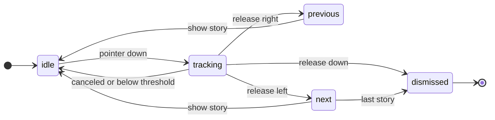
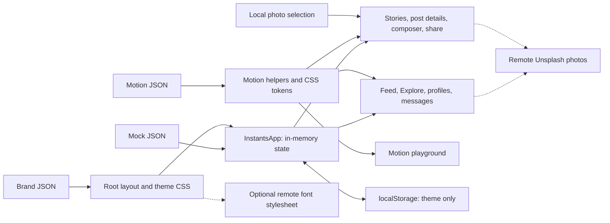

# Instants

**Good moments don't wait.**

A responsive social UI prototype for invitations, quick votes, and moments that need a response now. Built with React, TypeScript, and Vinext, with configurable branding, light and dark themes, and a motion system that keeps scrolling in the browser's hands.

[Get started](#run-locally) · [Motion](#motion-and-gestures) · [Architecture](#architecture) · [Contribute](CONTRIBUTING.md) · [MIT license](LICENSE)

<p align="center">
  
  
</p>

<p align="center">The mobile feed in light and dark themes.</p>

## What you can try

- **Live moments:** countdowns, invitations, and polls with shared response state in the feed and post details.
- **A complete UI journey:** stories, photo carousels, Explore, account search, profiles, saved posts, comments, and demo conversations.
- **Create and share:** select a local photo, add a caption, create an instant, or share a post into a demo conversation. Seeded posts support links such as `/?post=p1`.
- **Responsive navigation:** desktop sidebar, tablet rail, and a floating mobile glass dock.
- **Motion you can inspect:** touch and mouse gestures, scroll restoration, press feedback, and a dedicated `/motion` playground using shared primitives and tokens.

This is a frontend prototype with fictional accounts and conversations. Likes, responses, comments, uploads, and messages live in memory and reset on refresh. Only the theme preference persists. Reels use labeled still-photo previews; account switching and calls are presentation-only. There is no social backend or real account connection.

## Run locally

Use **Node.js 22.13 or newer** and npm.

```sh
git clone https://github.com/quirq-ai/instants.git
cd instants
npm ci
npm run dev
```

Open [localhost:5180](http://localhost:5180) for the app or [localhost:5180/motion](http://localhost:5180/motion) for the motion playground. No API keys or environment variables are required for the demo.

| Command | Purpose |
| --- | --- |
| `npm run dev` | Start the development server on port 5180 |
| `npm run lint` | Check source with ESLint |
| `npm run typecheck` | Check TypeScript without emitting files |
| `npm test` | Run the Node unit tests |
| `npm run test:e2e` | Run the Playwright browser tests |
| `npm run build` | Build the application |

Before the first browser test run, install its browser with `npx playwright install chromium`. On Linux, CI may also need Playwright's system dependencies: `npx playwright install --with-deps chromium`.

The build uses [build/hosting.example.json](build/hosting.example.json) when a local `.openai/hosting.json` is absent. The latter is optional, environment-specific configuration. A normal clone does not require access to the original hosting workspace. See [architecture](docs/architecture.md) for the build boundary.

## Motion and gestures

The motion system is a browser-based approximation of familiar social app interactions. Native touch and wheel scrolling retain platform momentum; JavaScript does not replace the page's scroll loop.

| Interaction | Behavior |
| --- | --- |
| Feed | Native vertical scrolling; returning to a view restores its position |
| Repeat Home | Programmatic scroll to the top, respecting reduced motion |
| Photo carousel | Native horizontal scroll snap, touch swipe, mouse drag, buttons, and keyboard controls |
| Stories | Swipe horizontally for previous/next; swipe down to dismiss; visible controls remain available |
| Press, like, navigation | Short CSS transitions and keyframes using shared durations and easing |
| Reduced motion | Suppresses decorative movement and avoids animated programmatic scrolling |

Story swipes follow this release-time decision path. Small or canceled gestures leave the story unchanged; advancing past the last story closes the viewer.



Edit [config/motion.json](config/motion.json) for shared timings and gesture thresholds. [docs/motion.md](docs/motion.md) explains the contract, input behavior, reduced motion, and how to verify changes. Visit `/motion` to exercise the same building blocks outside the feed.

<p align="center">
  
</p>

[Watch the recorded motion demo (WebM)](docs/media/motion-demo.webm).

## Make it yours

| File | Customize |
| --- | --- |
| [config/brand.json](config/brand.json) | Name, logo, fonts, colors, light/dark tokens, radius, and mobile dock |
| [config/motion.json](config/motion.json) | Durations, easing, and gesture thresholds |
| [data/mock.json](data/mock.json) | Users, posts, comments, Explore images, conversations, invitations, and polls |
| [app/globals.css](app/globals.css) | Layout and component styles |

Put local assets in `public/` and reference them with a leading `/`. Set `fontStylesheet` to an empty string to use local/system fonts. A saved theme overrides `defaultTheme`; clear the `ig-ui-theme` localStorage entry to test a new default. Production changes require a rebuild.

Each post can include an `instant` with a `kind` (`invite` or `poll`), `title`, `expiresInMinutes`, and response `options` containing `id`, `label`, and `count`. Countdown deadlines are initialized locally when the app opens. New posts receive a 30-minute response window.

## Architecture

The application state lives in a React client component. JSON supplies the starting content and design tokens; the server renders the application shell. The diagram shows the active UI data flow, not the optional hosting scaffold.



See [docs/architecture.md](docs/architecture.md) for component ownership, state lifetime, and the repository map.

## Privacy and project scope

Selected images are read locally for the preview and are not uploaded to a server. Avoid treating this demo as durable storage. Remote photos and the configured Google Fonts stylesheet make requests to their respective providers; replace them with local assets if you need a self-contained demo.

This project is independent of Instagram and Meta. It does not reproduce or claim access to their proprietary motion implementations.

## Contributing and license

Small, focused improvements are welcome. Read [CONTRIBUTING.md](CONTRIBUTING.md) for setup, checks, and review expectations, and [SECURITY.md](SECURITY.md) for reporting vulnerabilities privately.

Original project code is available under the [MIT license](LICENSE). Dependencies and vendored code retain their licenses. The Instants and Quirq names and logo assets, remote photography, and externally served fonts are not relicensed by this repository's MIT license. See [THIRD_PARTY_NOTICES.md](THIRD_PARTY_NOTICES.md) before reusing those assets.
