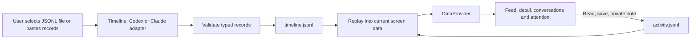
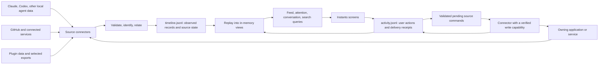
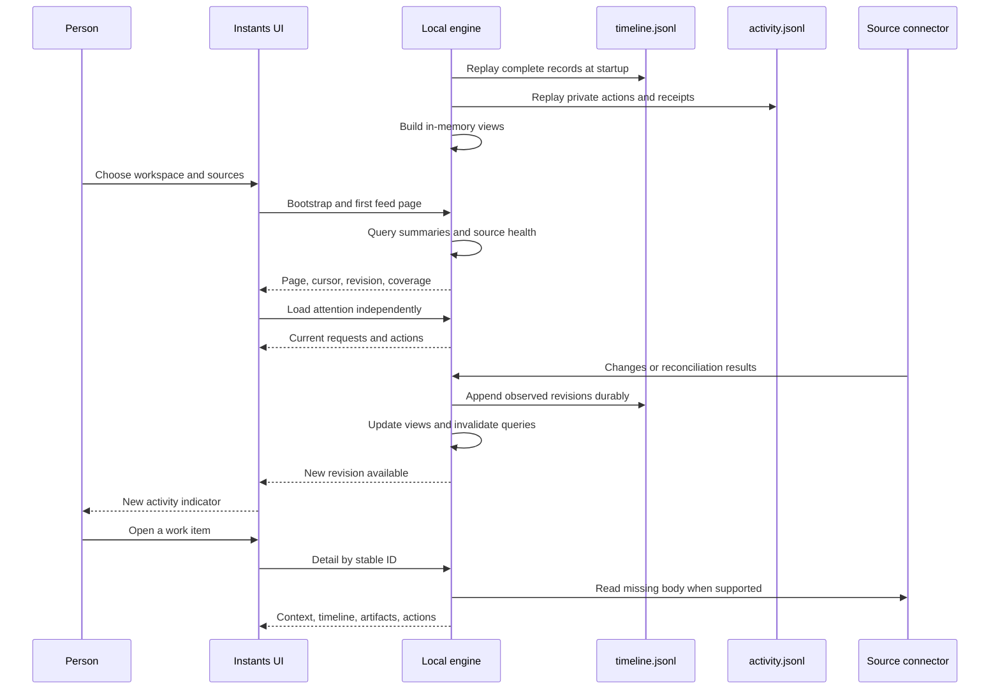
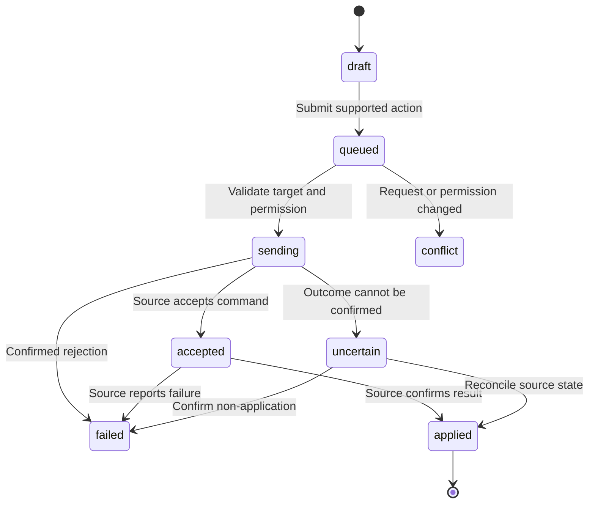

# Instants as a visual workspace for agent data

Status: two-log foundation implemented, October 7, 2026. [The runtime overview](architecture.md) and [engine guide](engine.md) describe the shipped behavior. This document also retains the target connector architecture; future discovery, queries and delivery are explicitly separated from the current implementation.

## Implemented now

- Exactly two persistent application data files per private profile: `.instants/<UUID>/timeline.jsonl` and `.instants/<UUID>/activity.jsonl`.
- Validated append/replay, event deduplication, file ownership, corruption diagnostics, import and separate exports. In-memory views need no persisted database or snapshot.
- User-selected Instants timeline, Codex conversation JSONL and Claude conversation JSONL imports. These native imports expose read-only history; no scan of `.agents` or the machine runs automatically.
- Provider-driven feed, attention, conversations, Explore, profiles and detail. Text-only cards and distinct conversation IDs work without assuming image posts or one thread per actor.
- Private read markers, bookmarks and notes, plus the existing local/demo interactions. Dismissal is personal; no source task is completed by a local click.
- A first-run demo timeline initialized once when both logs are empty. Errors do not silently replace existing logs with demo content.
- Vercel/browser persistence uses two JSONL localStorage keys rather than local filesystem writes. There is no third persistent outbox; failed, unacknowledged file writes stay in memory for retry/export while the tab remains open.



The current API loads a complete snapshot; the feed progressively renders 20 cards at a time. Independent cursor-based screen queries, lazy body retrieval, source watching/reconciliation, account connections, command dispatch and team synchronization remain planned. `source.state`, identity mappings and command receipt types define future-compatible contracts; they do not themselves establish running connectors or verified external actions.

## Product direction

Instants turns activity from agent applications into a feed that a person can read, inspect, and work through. `.agents` is the logical name for this collection of data. It does not require a particular directory, a shared file format, or moving existing application data.

Sources can include Claude, Codex, GitHub, plugins, other agent runtimes, and explicitly selected exports or folders. Some sources are local files, some are application APIs, and some are remote services. Each source keeps its own authoritative data. Instants connects them through a common reading experience.

The implemented foundation runs locally, remains private per browser profile, and makes reading useful before enabling external actions. The feed, people/agent rail, detail views, themes, and mobile dock remain the visual foundation.

## Target connector architecture

The target architecture keeps the existing UI/engine division. Future connected-source adapters feed two JSONL files, which the engine replays into queryable in-memory views. These are modules in one local application for the first release, not separate microservices. The two files are the complete persistent Instants data store for one person's local profile.



The UI requests product data, such as a feed page or a conversation. It does not read application files, interpret provider JSON, or decide how to send an upstream reply. Connectors do not render UI.

### Two files, one in-memory view

1. **`timeline.jsonl` saves what Instants can show:** normalized feed records, conversation/message records, actors, workspaces, artifacts, request state, and source metadata needed to resume ingestion. Updates and removals are appended as new lines. Observed records remain available after restart even when the source is temporarily offline.
2. **`activity.jsonl` saves what the person does:** read markers, bookmarks, follows, drafts, private notes, snoozes, source/scope selections, and account/workspace associations. External action intents, attempts, and delivery receipts live here too; they do not require a separate outbox file.
3. **In-memory views serve the screens:** replay both files to build maps, relationships, search, and pagination state. These views are disposable and rebuilt on startup. There is no persistent index database or snapshot file.

A viewer session, an agent conversation, and an execution run are different entities. The old `session/` journals are preserved but no longer used by the active runtime; the two logs now store the current profile. Original provider data stays in its owning application; `timeline.jsonl` stores Instants' observed representation rather than asserting control over that application.

## Source connectors

A connector understands one provider or format. A configured **source instance** identifies a particular installation, account, profile, or selected root. Two Codex installations or two GitHub accounts must have distinct source-instance IDs.

The proposed connector lifecycle is:

```text
discover candidates → user selects source/scope → initial scan
  → observe changes → periodically reconcile → expose diagnostics
```

Discovery lists candidates and capabilities; it does not ingest the entire machine. Installation/configuration files and skill definitions are not automatically feed activity.

Each connector declares:

- Its version, supported data kinds, and source schema versions.
- How it lists records and reads larger content on demand.
- Its checkpoint strategy and whether updates come from watching, polling, or an event API.
- Connection health, access limitations, and parsing diagnostics.
- Optional write capabilities, their target types, permissions, and acknowledgment behavior.

Claude/Codex connectors should initially expose available conversations, run activity, outputs, and source-backed input requests. Their exact supported formats and APIs must be verified against the installations used during implementation. File access alone does not establish a supported reply, approval, or resume API.

A GitHub connector exposes repository-scoped issues, pull requests, reviews, and discussions through its verified integration surface. It can participate even when none of its data lives in a local folder.

Plugins can supply connectors, records, renderable content, or supported commands through an explicit versioned contract. A plugin or skill definition describes a capability; discovering it does not authorize running it. Start with built-in trusted connectors; third-party executable plugin loading is a later boundary.

Unknown data remains visible as an unsupported source or an inspectable metadata record. It must not be silently interpreted as a conversation or action request.

## A small shared data model

Normalize the common envelope and relationships. Preserve provider-specific content through typed bodies or versioned extensions.

```ts
// Proposed contract; these types are not implemented yet.
type SourceRef = {
  sourceId: string; // configured source instance
  nativeId: string; // original ID or connector-managed identity
  revision?: string; // changes independently of identity
};

type AgentRecord = {
  id: string; // stable Instants ID, namespaced by source
  source: SourceRef;
  kind:
    | "conversation"
    | "message"
    | "run"
    | "task"
    | "request"
    | "artifact"
    | "change"
    | "definition";
  workspaceId?: string;
  parentId?: string;
  actorIds: string[];
  occurredAt?: string; // unknown source time is allowed
  observedAt: string; // when Instants observed the record
  title?: string;
  preview?: string;
  contentRef?: string; // opaque detail/asset reference
  relations: { kind: string; targetId: string }[];
  sourceState?: { value: string; normalized?: string };
  extensions?: Record<string, unknown>; // namespaced, versioned provider data
  actionIds: string[]; // available, target-specific actions
};
```

Keep companion records for **sources**, **workspaces**, **actors**, and **action descriptors** in the same timeline file. Actions describe known operations and validated input fields; content cannot supply executable commands. Provider-specific status names remain available even when a coarse display status exists. Not every timeline line creates a visible feed card: supporting records and ingestion metadata also support the other screens.

Identity rules:

- Namespace native IDs by source instance. A message ID from one account cannot collide with another account's ID.
- Use a persisted connector identity mapping when native IDs are absent. Append those mappings to `timeline.jsonl` as source metadata before records that depend on them; rebuilding the in-memory views then preserves bookmarks, drafts, and command targets. File paths, modification times, and message text alone are insufficient stable identities.
- Distinguish repository identity from checkout/worktree location. Let the person explicitly group related workspaces; matching folder names do not prove they are the same project.
- Relate a local run to a pull request using explicit metadata or a confirmed association. Preserve both records and their origins.
- Track mirrored/exported records with provenance. Prefer an authoritative observation when proven; uncertain duplicates stay distinguishable.
- Preserve unavailable/deleted references so bookmarks and open details do not resolve to unrelated records.

## Turning records into the feed

Raw tool calls and log lines should remain in the detail timeline. A feed entry represents a meaningful update or a unit of work that needs attention.

Examples below illustrate the proposed mapping, not detected activity:

- A Codex run produces a patch and test summary → a **work update** with a result summary and diff/test previews.
- A Claude conversation has an explicit, active question for the person → an **input request** linked to the relevant turn.
- A GitHub pull request requests a review → a **review card** linked to its review context and available actions.
- A plugin publishes a generated document → an **artifact card** with a safe preview and source link.
- A skill definition is discovered → an entry in **Sources/capabilities**, with feed activity only if a meaningful change is explicitly reported.

Cards share identity, actor, workspace, source badge, timestamps, and summary. Their body can be text, images, files, code/diff, test results, progress, or a request. Images and social reaction counts are optional. A text-only run is a complete feed item.

Group updates by an explicit conversation, run, task, change, or request ID. Do not collapse unrelated sessions because they share an author. Coalesce noisy progress events, while preserving the complete source timeline on demand. Use deterministic summaries first; AI summarization can be an optional feature with its own provenance and privacy settings later.

### People and agents at the top

The rail becomes an attention view grouped by actor, with source and workspace context. An agent, a person, or a service can appear there. Opening an actor with multiple outstanding items reveals those items rather than merging their conversations.

Useful categories are **All**, **Questions**, **Approvals**, **Reviews**, and **Failures**. Offer provider-specific categories only when a source supports them. A failure may require investigation without supporting a reply.

Keep **unread**, **possible follow-up**, and **explicitly awaiting input** separate. Historical questions and inferred questions must not appear as active approval requests. Active requests carry their source target, status, revision, and real expiry when provided; viewer-session creation time must not determine their deadline.

Request details also carry a requester and intended recipients/assignees when known. Each source instance records the viewer's identity for that source, using explicit account mapping rather than a matching display name. Distinguish **awaiting you**, **awaiting another actor**, and **recipient unknown**; only confirmed assignments belong in the personal “needs you” count. A broader workspace queue can show the other categories separately.

## Loading the screens

Introduce one application-facing `InstantsDataSource`. Both the mock provider and real engine implement its typed query contract. The UI never selects a parser based on a file extension or provider name.

```ts
// Conceptual interface; query/result types should be discriminated unions.
interface InstantsDataSource {
  bootstrap(scope: Scope): Promise<Bootstrap>;
  query(request: ReadQuery): Promise<ReadPage>;
  detail(ref: EntityRef): Promise<EntityDetail>;
  changes(scope: Scope, since: string): Promise<ChangeBatch>;
  execute?(command: SourceCommand): Promise<CommandReceipt>;
}
```

Screen responsibilities:

- **App shell:** load configured workspaces, sources, viewer settings, and connection state. Show sources needing setup without blocking healthy sources.
- **Home:** fetch a bounded page of feed summaries. Load more by cursor; fetch card bodies only when needed.
- **Attention rail:** query outstanding requests independently of the feed page, so off-screen work still reaches the person.
- **Request detail:** load the exact request, its conversation/context, and currently supported actions.
- **Post/work detail:** resolve the latest record by ID. Paginate transcripts and logs; lazily retrieve diffs and attachments.
- **Messages:** list conversations, then fetch messages by conversation ID. One actor may participate in many conversations.
- **Explore:** search/filter indexed work and artifacts. Image grids are one result presentation.
- **Profiles:** show a human/agent identity, provider context, associated work, and capabilities.
- **Saved:** join private bookmarks to source records, including explicit unavailable-item placeholders.
- **Reels/visual previews:** show suitable visual artifacts when present; do not generate fake media for text-only sources.
- **Create/share:** render available destinations and operations from source capabilities. A private note remains clearly private.
- **Sources:** add a small source-management view for scopes, connection health, initial indexing, rescans, and disconnection.
- **Motion lab:** continue using isolated demonstration fixtures.

Every query needs `loading`, `ready`, `empty`, `refreshing`, `stale`, and `error` states. Retain usable data while refreshing and identify partial source failures. Never replace failed real loading with mock content unless the person explicitly switches to demo mode.



Switching scope cancels pending reads and rejects late results from the old scope. Store selected IDs rather than copied post objects so open dialogs stay current. Use stable page snapshots/cursors with an ID tie-breaker; live updates must not create pagination gaps or jump the reader's scroll position. Show a “new activity” affordance for updates above the current position.

Start incremental updates with polling and a revision cursor. Add server-sent invalidations if needed without changing screen contracts. Filesystem watching is an optimization, paired with initial and periodic reconciliation; it is not a reliable database change log.

## Working through an item

There are two action paths:

**Private actions** - save, mark read, draft, snooze, follow, add a private note - append to `activity.jsonl` and update its in-memory projection. "Dismiss for me" affects the private queue view without claiming upstream work is complete.

**Source actions** — reply, review, approve, resume, or retry — exist only when a connector exposes and verifies that exact operation. The engine checks current target, permissions, revision, and request state before sending it. Read-only connectors can offer a verified “open in source” link or location instead.



Append the command intent to `activity.jsonl` before sending, including a command ID, precise target, and expected revision where supported. Append its attempts and receipts to the same file, retaining the command ID across lifecycle events. Preserve uncertain delivery outcomes across restarts. Retries reuse the same command identity only when provider idempotency or reconciliation makes that safe; do not promise universal exactly-once execution. Replaying old activity reconstructs delivery state; it must not blindly resend historical commands.

“Accepted” is not proof that the underlying task completed. A confirmed reply may still leave a review or question open. Only observed source state closes the source request. The demo's current behavior of resolving all a person's DMs after a local send must not carry into the real engine.

## Implemented two-file storage contract

Each private profile uses this directory, selected through the local `HttpOnly` `instants-session` cookie:

```text
.instants/<profile-uuid>/
  timeline.jsonl
  activity.jsonl
```

Each complete line is a validated `{ v, id, at, type, targetId, data }` object. `v` is `1`, `id` is an event UUID and `targetId` is the stable identity being changed. Physical file order governs replay. Exact retry IDs are idempotent; conflicting reuse is rejected.

### Timeline data

A timeline `record.upsert` uses **`data: { kind, value }`**, where `kind` is `viewer`, `person`, `workspace`, `post`, `thread`, `attention`, `explore`, or `source`. A value carrying an `id` must match the envelope target; the validator rejects contradictory identities.

<!-- prettier-ignore -->
```jsonl
{"v":1,"id":"c0bc2ce4-d0b2-4a92-ae96-95a4e135cf41","at":"2026-10-07T10:00:00.000Z","type":"record.upsert","targetId":"codex-local:work-42","data":{"kind":"post","value":{"id":"codex-local:work-42","userId":"codex-local:agent","workType":"Agent update","location":"Codex","time":"Oct 7","images":[],"alt":"Login fix ready for review","caption":"Updated the form and added regression tests.","tags":"","likes":0,"commentCount":0,"comments":[],"source":{"id":"codex-local","label":"Codex","nativeId":"work-42","readOnly":true}}}}
```

Append another upsert for the same target to update one card. `record.remove` removes the target from the current view while preserving log history; unavailable-bookmark UI is still planned. `source.state` stores status/checkpoint metadata and `identity.bound` stores mappings. These metadata contracts do not start ingestion or command delivery.

### Private activity

<!-- prettier-ignore -->
```jsonl
{"v":1,"id":"0f3f28df-e094-45df-8749-5a154ffcc0e2","at":"2026-10-07T10:01:00.000Z","type":"item.read","targetId":"codex-local:work-42","data":{"read":true}}
{"v":1,"id":"cc3d315a-f982-4fb1-a74a-54842113f9f5","at":"2026-10-07T10:02:00.000Z","type":"post.save","targetId":"codex-local:work-42","data":{"postId":"codex-local:work-42","saved":true}}
```

Current actions include profile creation, item reads, saves, private notes, conversation reading and personal request dismissal. Existing local/demo interaction events remain supported. Native imports have no external-send controls. Draft, snooze and command lifecycle types are reserved for later workflows; there is no running source command dispatcher.

### Load and recovery

Replay both files into memory, join private actions by stable target ID, then render through the data provider. Local writes are serialized, validated, deduplicated, appended and flushed before a persistence acknowledgment. The store takes a process-level loopback lock without creating a lock-file sidecar. An invalid or unterminated line preserves original bytes, exposes diagnostics and blocks further writes rather than silently truncating a journal.

The local limits are 32 MiB per log, 4 MiB per line and 500 records per append. The initial implementation reads full logs and exposes bounded feed rendering; offset-based lazy reads and paginated server queries are future optimizations. There is no automatic compaction or third index/checkpoint/snapshot file.

On Vercel the two logs are JSONL strings in `instants-timeline-v1` and `instants-activity-v1`. Browser quota can be smaller than local limits. Pending file writes are held in memory, not a durable outbox, so failed saves should be retried or exported before closing the tab. **Export timeline** and **Export activity** provide the two separate files.

See [engine.md](engine.md) for the API, all implemented event semantics, storage modes and the preserved legacy-session boundary.

## Future connected-source deployment

For future automatic connectors, the local Node application will read approved source locations, own the two JSONL files, and serve the UI. Current native imports only read the files explicitly selected by the person. Keep their private state directory outside watched source roots and repository publishing paths. Private source payloads, local paths, tokens, and the two logs must stay out of browser bundles, diagnostic logs, static output, Git, and deployment traces. Return opaque asset IDs; the engine enforces source-root containment and handles symlinks/junctions before reading files. Render source text and artifacts as untrusted content.

Bind the private engine to loopback by default. Validate allowed Host/Origin values and require an authorized, session-bound connection for private reads, asset access, and commands. Establish that session through a controlled local launch/pairing flow; an unrelated website must not gain access by calling a public bootstrap endpoint. LAN or remote access requires a separate authenticated mode. The current demo's random journal cookie alone is not the access-control design for machine-wide private data.

The existing Vercel deployment remains useful for the demo or explicitly provided snapshots. Reading a person's machine from a hosted UI requires a separately designed, authenticated local bridge and explicit sharing scope. It is outside the first local release; connecting a source must not automatically upload its content.

## Reliability requirements

- Handle partial JSONL writes, rotation, truncation, atomic replacements, malformed records, and schema changes. Keep the last valid data and expose diagnostics.
- Track source time and observation time separately. Unknown source time is visible, not invented.
- Idempotently ingest repeated observations; track revisions and deletion markers.
- Disconnection or a failed scan does not mean “no outstanding work.” Show incomplete coverage and stale data.
- Limit initial scans and detail payloads. Large histories and artifacts must not block initial rendering.
- Rebuilding in-memory views from both files preserves private state, drafts, identities, and command receipts. A removed source invalidates its capabilities immediately.
- Distinguish disconnecting a source from explicitly removing its cached/indexed content; never delete upstream data as a side effect.

## Migration status and next increments

The foundation is implemented: domain types no longer import fixture data; product screens read one provider; source data and private activity have separate logs; native imports preserve conversation identity; optional media and neutral actors work across the screens. New profiles seed the example timeline once. Legacy `session/<UUID>/session.json` files and the old browser key are preserved without automatic migration, and legacy demo replies never become pending external commands.

The original diagrams above describe the target architecture. Remaining increments are:

1. **Automatic local reading.** Add scoped discovery, permission-aware roots and reconciliation for one verified installed provider. Selected-file imports remain useful even when no live integration exists.
2. **Independent screen queries.** Add revision-aware pagination, lazy detail and artifact reads, unavailable-item placeholders and controlled new-activity indicators. The existing bounded card rendering is the starting point.
3. **A structurally different source.** Add GitHub or a verified plugin connector without embedding provider parsing in UI components. Preserve namespace and provenance across accounts.
4. **Expanded private workflow.** Expose drafts and snoozes on the existing activity contract, with restart-safe replay and explicit failure handling.
5. **One verified external action.** Add a real reply/review operation only after target permissions, revisions, duplicate retries, uncertain delivery and acknowledgments have been tested. Source observations, not optimistic clicks, determine upstream completion.

The two-log contract remains the storage boundary for these increments. Provider authentication, connector scopes and supported write surfaces must be verified as each integration is built.
