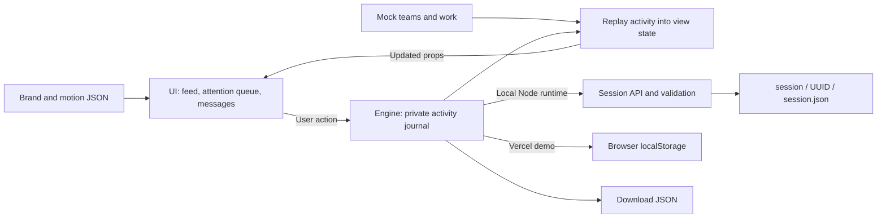

# Architecture

Instants has two parts: the **UI** presents work and the people waiting for a response; the **engine** records a person's activity and rebuilds their private demo state. Both ship in one Next.js application. The split is a code boundary, not a pair of separately deployed services.

| Section | Owns                                                                           | Start here                       |
| ------- | ------------------------------------------------------------------------------ | -------------------------------- |
| UI      | Feed, attention queue, conversations, navigation, overlays, themes, and motion | [UI architecture](ui.md)         |
| Engine  | Activity schema, validation, persistence, and replay into visible state        | [Engine architecture](engine.md) |

## The product model

The sample feed follows two companies, `xo_builders` and `quirq_ai`, sharing work for feedback, testing, and decisions. The avatar rail is an attention queue: a DM, comment, mention, or review request identifies a person who needs a response. Opening a queue item keeps its request and relevant work together. Replying or marking it resolved updates that person's private demo state.

The companies and teammate conversations are sample content. There is no account connection, real delivery, shared team database, or real-time synchronization. Each person has a separate journal for now; all journals replay against the same versioned seed data.

## Routes and source map

| Location                    | Responsibility                                                                |
| --------------------------- | ----------------------------------------------------------------------------- |
| `app/layout.tsx`            | Metadata, brand variables, font stylesheet, saved theme bootstrap             |
| `app/page.tsx`              | Application entry point                                                       |
| `app/motion/page.tsx`       | Interactive motion playground                                                 |
| `app/api/session/route.ts`  | Private local session read/append boundary; hosted mode selection             |
| `components/instagram/`     | Product UI; the directory retains its original source name                    |
| `components/collaboration/` | Categorized people queue, request dialog, team and session presentation       |
| `components/motion/`        | Shared carousel and motion examples                                           |
| `components/ui/`            | Dialogs, menus, and other reusable UI primitives                              |
| `hooks/use-session.ts`      | Browser session controller and persistence status                             |
| `engine/`                   | Activity types, runtime validation, state projection, and session persistence |
| `config/`                   | Brand and motion configuration                                                |
| `data/mock.json`            | Team accounts, work, conversations, and attention requests                    |
| `session/`                  | Local runtime journals; excluded from Git                                     |

Home, Explore, Reels, Messages, Saved, and Profile are views inside `InstantsApp`, not separate application routes. Seeded `?post=<id>` links open a post detail dialog. A privately created post is only available where its journal exists; sharing its ID does not publish it to another person's session.

## Build and hosting boundary

`npm run dev`, `npm run build`, and `npm start` invoke Next.js directly. The production build is written to `.next`; development and production servers use port 5180. The repository's `vercel.json` selects the Next.js framework, `npm ci`, `npm run build`, and `.next`. Import the repository root (`.`) into Vercel. No API keys, database, `.openai` configuration, or Cloudflare bindings are needed for this path.

In local Node development, the session API persists JSON under `session/`. On Vercel, the app uses browser storage instead of depending on a writable, durable server filesystem. This preserves a usable hosted demo; it does not provide cross-device or team persistence. See the [storage modes and privacy contract](engine.md#storage-modes).

GitHub CI builds the production Next.js application and runs browser tests against its production server. Local browser tests start the development server by default or use an existing server supplied through `PLAYWRIGHT_BASE_URL`.

The optional `dev:sites`, `build:sites`, and `start:sites` commands retain the original Sites scaffold. Its `scripts/run-framework.mjs` entry point can use `build/hosting.example.json`, with an untracked `.openai/hosting.json` for a specific environment. These commands are separate from the supported Next.js/Vercel session-storage path. Node filesystem persistence is not a Cloudflare Worker storage adapter.

Database packages and connector helpers inherited from the starter do not imply a connected backend. A shared team release will need authentication, team membership and authorization, durable storage, and a delivery/synchronization contract before those features are real.

## Changing the application

Change sample content in JSON, presentation in UI components, and persistence rules in the engine. Keep event payloads independent of React elements, DOM nodes, and animation state. A new persistent interaction should have a validated event, a replay rule, and a behavior test; a new visual interaction should reuse the established motion and accessibility primitives. The [contribution guide](../CONTRIBUTING.md) covers the checks.
