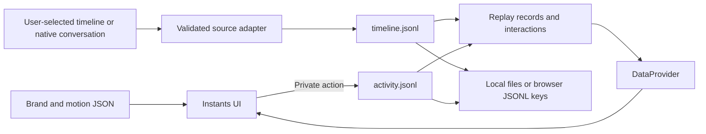

# Architecture

Instants has two code responsibilities in one Next.js application: **UI** presents work and **engine** normalizes, saves and replays data. The active data store has two persistent files per private profile, not a database plus a session snapshot.

| Section | Owns                                                                        | Guide                            |
| ------- | --------------------------------------------------------------------------- | -------------------------------- |
| UI      | Feed, source context, attention, conversations, overlays, themes and motion | [UI architecture](ui.md)         |
| Engine  | JSONL contracts, imports, identity, persistence, recovery and replay        | [Engine architecture](engine.md) |

## Implemented product boundary

A new profile receives the `xo_builders` and `quirq_ai` example records once. Real history enters through **Import timeline**, which accepts the Instants format, Codex conversation JSONL, or Claude conversation JSONL. Merge keeps existing records; replace changes the feed while retaining the separate private activity log.

Imported text-only cards, full detail, separate conversation identities, source labels, bookmarks and private notes use the existing UI. No social image or reaction count is required. The attention rail continues to display explicit request records. Historical questions are not inferred to be live approvals.

Native imports are read-only. Local/demo interactions remain local. There is no automatic folder discovery, GitHub account integration, executable plugin loader, cross-device team state, or verified external command delivery. The broader design and staged connector work remain in [agent-data-architecture.md](agent-data-architecture.md).

## Routes and source map

| Location                                       | Responsibility                                                           |
| ---------------------------------------------- | ------------------------------------------------------------------------ |
| `app/layout.tsx`                               | Metadata, JSON brand variables, fonts and saved theme                    |
| `app/page.tsx`                                 | Application entry                                                        |
| `app/motion/page.tsx`                          | Isolated motion examples                                                 |
| `app/api/session/route.ts`                     | Private snapshot, append, import, export and hosted mode selection       |
| `components/data-provider.tsx`                 | Current data and safe actor/workspace lookups                            |
| `components/instagram/`                        | Product screens and overlays; directory retains its original name        |
| `components/collaboration/`                    | Attention rail, request detail and source/import presentation            |
| `components/motion/`                           | Shared gestures and isolated examples                                    |
| `hooks/use-session.ts`                         | Client persistence controller, status, import/export and private actions |
| `engine/log-types.ts`, `engine/log-schema.mjs` | Versioned JSONL envelope and runtime validation                          |
| `engine/timeline.mjs`                          | Record replay and explicit first-run seed conversion                     |
| `engine/jsonl-store.mjs`                       | Node file ownership, serialized appends and corruption diagnostics       |
| `engine/projection.ts`                         | Supported local/demo interaction projection                              |
| `lib/data.ts`                                  | Domain types, without fixture imports                                    |
| `config/`                                      | Brand and motion configuration                                           |
| `data/mock.json`                               | First-run examples and isolated motion fixtures                          |
| `.instants/<UUID>/`                            | Private `timeline.jsonl` and `activity.jsonl`, ignored by Git            |
| `session/`                                     | Preserved legacy data, no longer written by the active runtime           |

Home, Explore, Reels, Messages, Saved and Profile are views inside `InstantsApp`. `?post=<id>` resolves a current timeline record by stable ID. Open dialogs also retain IDs instead of stale copies. Importing an update can therefore refresh an already open item. A link does not publish private content to another profile.

The app initially loads a snapshot, replays both logs, and distributes data through context. The feed renders 20 cards at a time with a load-more control. This initial version does not claim independent paginated network queries for every screen; that is a future scaling boundary. Missing avatars use neutral initials, text-only Explore cards remain usable, and Reels displays an empty state when there are no visual artifacts.

## Build and hosting boundary

`npm run dev`, `npm run build`, and `npm start` invoke Next.js directly. The production build is written to `.next`; development and production servers use port 5180. The repository's `vercel.json` selects the Next.js framework, `npm ci`, `npm run build`, and `.next`. Import the repository root (`.`) into Vercel. No API keys, database, `.openai` configuration, or Cloudflare bindings are needed for this path.

In local Node development, the session API persists `timeline.jsonl` and `activity.jsonl` under `.instants/<profile-UUID>/`. On Vercel, the app uses browser storage instead of depending on a writable, durable server filesystem. This preserves a usable hosted demo; it does not provide cross-device or team persistence. See the [storage modes and privacy contract](engine.md#storage-modes).

GitHub CI builds the production Next.js application and runs browser tests against its production server. Local browser tests start the development server by default or use an existing server supplied through `PLAYWRIGHT_BASE_URL`.

The optional `dev:sites`, `build:sites`, and `start:sites` commands retain the original Sites scaffold. Its `scripts/run-framework.mjs` entry point can use `build/hosting.example.json`, with an untracked `.openai/hosting.json` for a specific environment. These commands are separate from the supported Next.js/Vercel two-log path. Node filesystem persistence is not a Cloudflare Worker storage adapter.

Database packages and connector helpers inherited from the starter do not imply a connected backend. A shared team release will need authentication, team membership and authorization, durable storage, and a delivery/synchronization contract before those features are real.

## Changing the application

Add source formats at the normalization boundary, not inside presentation components. Keep stable source and conversation identities; do not merge unrelated work merely because it has the same author. Feed content belongs in timeline records. Private reading state, bookmarks and notes belong in activity records.

A new persistent interaction needs a validated event, a replay rule, and meaningful behavior tests. A new external action additionally needs a verified source capability and delivery contract before its control appears in the UI. Reuse the existing themes, motion and accessibility primitives for visual changes.
