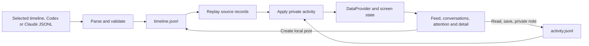
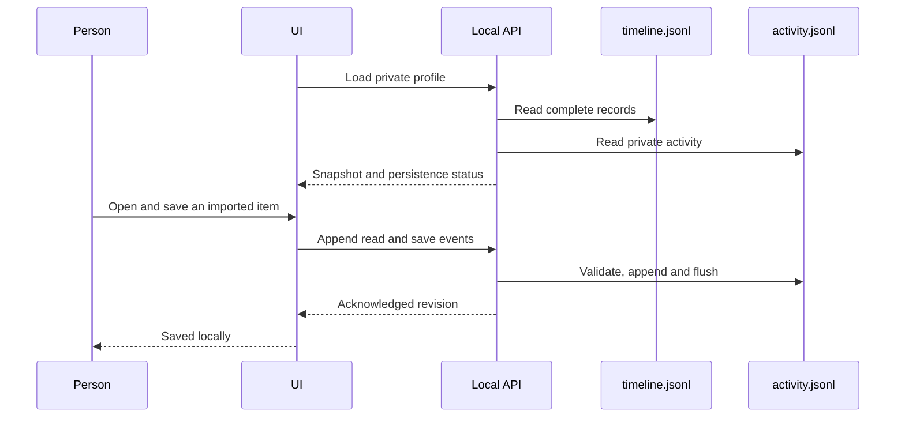

# Engine architecture

Instants persists two JSONL logs for each private profile. `timeline.jsonl` contains the feed and its supporting records; `activity.jsonl` contains the viewer's interactions. React receives a replayed view of those logs through a data provider. It does not import the mock fixture as live application state.

The implemented source boundary is **user-selected imports**: Instants timeline JSONL, Codex conversation JSONL, and Claude conversation JSONL. Native conversation imports are read-only history. There is no automatic machine scan, GitHub account connector, plugin execution, or external reply delivery.

## Data flow



Brand tokens, motion settings, menus, carousel position, and temporary form state stay outside the data engine. The first empty profile receives the example feed once, as ordinary timeline records. Subsequent loads replay the logs; failed loads never substitute fixture content.

## Two files per profile

```text
.instants/
  <profile-uuid>/
    timeline.jsonl
    activity.jsonl
```

The local API chooses the UUID using the `HttpOnly` `instants-session` cookie. Request bodies do not select filesystem paths. Both runtime files are excluded from Git and deployment traces. There is no persistent snapshot, index database, metadata file, lock file, or separate outbox. A process-level loopback lock prevents a second local writer from owning the same directory.

`npm run dev` and `npm start` bind to `127.0.0.1`. Local journal routes reject foreign hosts and origins. Mutation requests include `X-Instants-Profile` matching the cookie, so a profile change cannot redirect an older tab's pending activity. Set `INSTANTS_DATA_DIR` to choose a different private storage root; keep that directory outside your published source tree.

A browser profile is a convenience boundary, not authenticated identity. People sharing a browser profile share its Instants data. The local server owner can read these plaintext files. This release does not expose machine-wide agent folders to the browser.

## Shared envelope

Each complete line is one JSON object followed by a newline:

```ts
type LogEnvelope = {
  v: 1;
  id: string; // Event UUID; reuse for an exact retry.
  at: string; // ISO timestamp.
  type: string; // Validated event vocabulary.
  targetId: string; // Stable identity of the record or action target.
  data: object; // Typed payload for this event.
};
```

Physical log order determines replay. Timestamps do not reorder events. An identical event UUID and payload is an idempotent retry; the same UUID with different contents is a conflict. Different events targeting one record update that record rather than creating duplicate cards.

### Timeline records

`record.upsert` has `data: { kind, value }`. Supported `kind` values are `viewer`, `person`, `workspace`, `post`, `thread`, `attention`, `explore`, and `source`. If a record has an `id`, it must equal the envelope's `targetId`. This checked identity keeps screen lookups, bookmarks and updates consistent.

<!-- prettier-ignore -->
```jsonl
{"v":1,"id":"c0bc2ce4-d0b2-4a92-ae96-95a4e135cf41","at":"2026-10-07T10:00:00.000Z","type":"record.upsert","targetId":"codex-local:work-42","data":{"kind":"post","value":{"id":"codex-local:work-42","userId":"codex-local:agent","workType":"Agent update","location":"Codex","time":"Oct 7","images":[],"alt":"Login fix ready for review","caption":"Updated the form and added regression tests.","tags":"","likes":0,"commentCount":0,"comments":[],"source":{"id":"codex-local","label":"Codex","nativeId":"work-42","readOnly":true},"occurredAt":"2026-10-07T10:00:00.000Z"}}}
```

Companion source/person/workspace records provide context. Text-only posts are valid. Optional `body` holds longer imported text; media is optional. Thread IDs identify conversations independently from their authors, so two conversations with the same agent stay separate.

`record.remove` removes a target from the active timeline view. Its historical upsert/removal lines and private activity remain in the logs. Unavailable bookmarked-item placeholders are a later UI improvement. `source.state` and `identity.bound` preserve source health/checkpoint and identity metadata; they do not themselves run a connector or schedule scans.

### Activity records

<!-- prettier-ignore -->
```jsonl
{"v":1,"id":"0f3f28df-e094-45df-8749-5a154ffcc0e2","at":"2026-10-07T10:01:00.000Z","type":"item.read","targetId":"codex-local:work-42","data":{"read":true}}
{"v":1,"id":"cc3d315a-f982-4fb1-a74a-54842113f9f5","at":"2026-10-07T10:02:00.000Z","type":"post.save","targetId":"codex-local:work-42","data":{"postId":"codex-local:work-42","saved":true}}
```

| Event                                         | Current purpose                                                          |
| --------------------------------------------- | ------------------------------------------------------------------------ |
| `profile.created`                             | Preserve the private profile identity in the log.                        |
| `item.read`                                   | Remember an opened work item.                                            |
| `post.save`                                   | Set a bookmark with an explicit `saved` boolean.                         |
| `note.added`                                  | Add a private note to a source item.                                     |
| `message.read`                                | Mark one conversation read; optional `threadId` identifies it precisely. |
| `queue.resolve`                               | Resolve local requests or dismiss imported requests for this viewer.     |
| `post.like`, `person.follow`, `post.respond`  | Preserve supported local/demo interactions.                              |
| `post.comment`, `message.send`, `queue.reply` | Update local/demo discussions; these are not external sends.             |

The schema also reserves `item.snoozed`, `draft.updated`, `command.requested`, and `command.receipt`. Their presence in the contract does not mean the UI exposes every operation or that a command dispatcher exists. External approvals, replies, retries, and resumptions remain unavailable until a verified source integration is implemented.

Native imported cards expose read, save and private notes. Imported conversations show source history and omit the reply composer. Imported attention items use **Dismiss for me**, without changing source task status. Historical questions are not automatically promoted to active requests.

## Load, append and recovery

1. Read and validate complete timeline lines, then replay them into records keyed by stable IDs.
2. Read activity lines and overlay private interactions onto the latest records.
3. Supply the result to `DataProvider` and the existing screen components. The feed renders 20 cards at a time; **Load more activity** progressively reveals the rest. This is bounded rendering, not a cursor-based query API.
4. Validate mutations and serialize local appends. Flush complete records before acknowledging persistence. Repeated event IDs are safe to retry.
5. Report malformed or unterminated lines as blocking diagnostics. Preserve the original bytes and the valid prefix for inspection. Do not silently truncate files, reset the profile, or append onto an incomplete tail.

An import first validates its records. By default it merges by stable record identity. **Replace the existing feed** removes the active timeline records before applying the selected import; the activity log remains separate. Native source data is never rewritten. Imports do not clear bookmarks or notes merely because a target is absent from the replacement feed.

Pending file writes stay in memory until acknowledgment. The UI reports saving/error status and offers retry and export. There is no durable third outbox file: closing a tab before an unacknowledged write succeeds can lose that pending change. Export before leaving when a write has failed.

The local store limits each log to 32 MiB, each record to 4 MiB, and each append batch to 500 records. Source-specific parsers and API requests may impose smaller limits. Browser storage has its own quota and can fill earlier. No automatic compaction or silent deletion runs in this release.

Malformed JSON and incomplete tails can be exported unchanged through the UI. Files exceeding the read limit or containing invalid UTF-8 remain untouched on disk; copy those original files directly before repairing them, because the API cannot export them.

## API and storage modes

| Request                                                           | Responsibility                                                                                       |
| ----------------------------------------------------------------- | ---------------------------------------------------------------------------------------------------- |
| `GET /api/session`                                                | Select the private profile, initialize once when empty, return the two-log snapshot or browser mode. |
| `GET /api/session?since=<revision>`                               | Refresh using the current revision.                                                                  |
| `GET /api/session?export=timeline`                                | Export the private timeline log in local file mode.                                                  |
| `GET /api/session?export=activity`                                | Export the private activity log in local file mode.                                                  |
| `POST /api/session` with `{ log, entries }`                       | Validate and append a batch to the selected log.                                                     |
| `POST /api/session` with `{ action: "import", entries, replace }` | Import normalized timeline records.                                                                  |

Local Node development and production write the two files under `.instants/<UUID>/`. Vercel explicitly selects browser persistence: `instants-timeline-v1` and `instants-activity-v1` hold the two JSONL strings in localStorage. A hosted browser cannot read the user's machine automatically. A chosen file is parsed in the browser; native imports are not an agent account connection.



Use **Import** on the feed or **More → Import timeline** to select the format and file, or paste JSONL. **Export timeline** and **Export activity** download separate logs. Export controls also remain available from the import dialog on mobile. Exports can contain private transcript text and should be handled as personal data.

## Legacy session files

Earlier versions used `session/<UUID>/session.json` and browser key `instants-session-v1`. Those legacy files/keys are not the active store. They are preserved; there is no automatic migration that could reinterpret old demo replies as external commands. See [session/README.md](../session/README.md).

## Code boundaries

- `lib/data.ts`: domain types without fixture imports.
- `engine/log-types.ts` and `engine/log-schema.mjs`: validated JSONL contracts.
- `engine/timeline.mjs`: timeline replay and explicit seed conversion.
- `engine/jsonl-store.mjs`: Node file ownership, reads and serialized writes.
- `engine/local-workspace.mjs`: profile initialization, import replacement and recoverable local-card writes.
- `engine/importers.mjs`: selected-file timeline, Codex and Claude adapters.
- `engine/workspace.ts`: portable activity overlay and browser log operations.
- `engine/projection.ts`: local/demo activity projection.
- `hooks/use-session.ts`: loading, persistence status, import/export and private actions.
- `components/data-provider.tsx`: data and safe identity lookups for product screens.

The broader connector and command architecture remains in [agent-data-architecture.md](agent-data-architecture.md). Reading and private progress are implemented first; account authentication, automatic discovery, long-lived source watching and verified external commands are separate increments.
