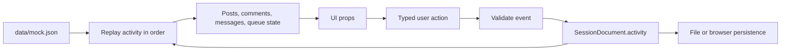
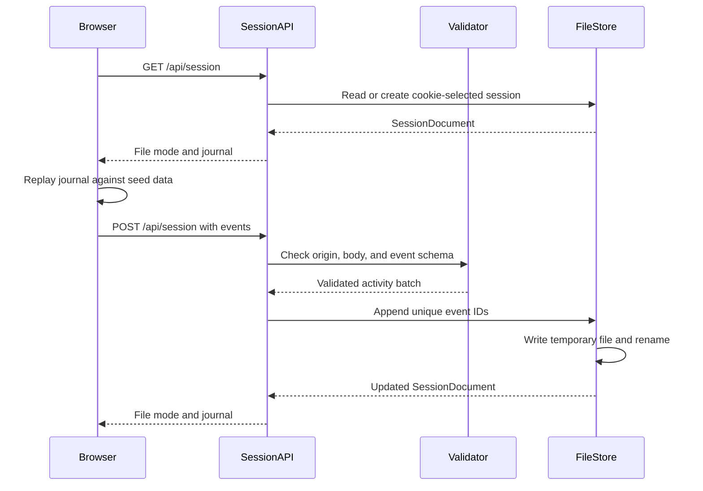

# Engine architecture

The engine keeps one simple activity journal for a person's demo session. The UI derives the current state by applying that activity to `data/mock.json`. There is no database, separate message service, or duplicated snapshot of every view.

The current boundary is **private per person**, implemented as a browser session identity. There is no sign-in or verified identity yet. The two sample companies share seed content, not runtime activity.

## Data flow



An activity describes a product action, such as saving a post or replying to a review request. Persistent actions pass through this boundary. Opening a menu, moving a carousel, and changing the current filter remain UI state.

## A small session folder

Local development creates one folder for each random session UUID:

```text
session/
  <session-uuid>/
    session.json
```

The runtime session folders are excluded from Git and Next.js deployment traces. The Node adapter creates them at runtime; a local production build does not package existing journals. Keep private replies, uploads, and downloaded journals out of commits and issue attachments. The application does not require checked-in user data to start.

The document contains metadata and an ordered activity array:

```json
{
  "schemaVersion": 1,
  "id": "c8d6e8fb-dfa9-4f2b-a3f9-91d4cae57b7d",
  "userId": "you",
  "createdAt": "2026-10-03T09:00:00.000Z",
  "updatedAt": "2026-10-03T09:04:00.000Z",
  "activity": [
    {
      "id": "3c8fd5ba-8b58-4fb7-a014-e928daea62ee",
      "type": "post.save",
      "at": "2026-10-03T09:04:00.000Z",
      "data": {
        "postId": "p1",
        "saved": true
      }
    }
  ]
}
```

| Field                    | Meaning                                                      |
| ------------------------ | ------------------------------------------------------------ |
| `schemaVersion`          | Data contract version; currently `1`                         |
| `id`                     | UUID identifying this private journal                        |
| `userId`                 | Current demo persona, `you`; not an authenticated account ID |
| `createdAt`, `updatedAt` | ISO timestamps for the journal                               |
| `activity`               | Ordered, validated events used to reconstruct the UI         |
| Event `id`               | UUID used to make retries idempotent                         |
| Event `type`             | Supported action name                                        |
| Event `at`               | ISO timestamp for the action                                 |
| Event `data`             | Small payload validated for that action                      |

Store the intended value when an action can be toggled: `{ "saved": true }`, rather than a generic `toggle`. Replaying an action should produce the same result as performing it once. Event IDs prevent retrying a batch from appending the same action again.

## Activity vocabulary

| Type            | Data                                                  | Visible effect                                                       |
| --------------- | ----------------------------------------------------- | -------------------------------------------------------------------- |
| `post.like`     | `postId`, `liked`                                     | Set the person's like state                                          |
| `post.save`     | `postId`, `saved`                                     | Add or remove a bookmark                                             |
| `person.follow` | `userId`, `following`                                 | Set follow state for a sample account                                |
| `post.respond`  | `postId`, `optionId`                                  | Choose a quick response                                              |
| `post.comment`  | `postId`, `text`                                      | Add a comment to work                                                |
| `message.send`  | `userId`, `text`                                      | Add an outgoing message to a demo conversation                       |
| `message.read`  | `userId`                                              | Mark the demo conversation read                                      |
| `queue.reply`   | `itemId`, `userId`, `kind`, optional `postId`, `text` | Reply in the related thread or post comments and resolve the request |
| `queue.resolve` | `itemId`, `resolved`                                  | Set whether a request still needs attention                          |
| `post.create`   | `post`                                                | Add a privately created post                                         |

`queue.reply.kind` is one of `dm`, `comment`, `mention`, or `review`. DM replies go to a demo thread; a non-DM request with `postId` adds a comment; a standalone request without a post goes to a thread. Payload validation lives in `engine/schema.mjs`; `engine/types.ts` describes the TypeScript contract. See those files for the full `post.create` shape and accepted field constraints.

Reply routing uses the seeded request's context, rather than trusting the event to redirect a reply to a different post or person. Sending a message directly in Messages also resolves that person's pending DM requests. Seeded response deadlines start at `session.createdAt`; newly created post deadlines start at the `post.create` event's `at`. Replaying after refresh preserves those deadlines.

## Storage modes

| Runtime                   | Storage                       | Scope and lifetime                                                                                                   |
| ------------------------- | ----------------------------- | -------------------------------------------------------------------------------------------------------------------- |
| Local Next.js Node server | `session/<UUID>/session.json` | A browser cookie selects a file on that server; survives refresh and server restart while the file and cookie remain |
| Vercel                    | Browser localStorage          | Private to this browser profile and origin; survives refresh while site data remains                                 |
| JSON download             | A copy chosen by the user     | Portable inspection/backup artifact; no automatic import or team sharing                                             |

Locally, an `HttpOnly`, `SameSite=Lax` cookie named `instants-session` holds the random session ID. It is `Secure` in production. The API chooses the session from that cookie; clients cannot select a different person's file by passing an ID in the URL or body.

On Vercel, `GET /api/session` returns `{ "mode": "browser", "session": null }`. The browser stores the same document shape in localStorage under `instants-session-v1`. Hosted POST persistence is unavailable (`501`); the browser adapter does not use it for saves. This avoids claiming durable server storage on a serverless filesystem.

The UI reports **Saved locally** for file mode and **Saved on this device** for browser mode. In local mode, pending writes are cached under `instants-outbox:<sessionId>` when browser storage is available, then retried explicitly or when connectivity returns. If browser storage is blocked or full, pending writes can only remain in memory until the server acknowledges them; export before closing an unsaved session. **Export session** downloads `instants-session-<UUID>.json`, matching the journal shape inside the local session folder. It is a manual inspection or backup feature; there is no import or cross-device synchronization.

Separate browser profiles receive separate journals. Two tabs in the same browser profile and origin can access the same browser storage or session cookie; this is not an account-level privacy boundary. The local server owner can read the plain JSON files. Browser localStorage, pending events, and downloaded JSON are also unencrypted. Clearing cookies or site data can detach or remove a session.

## Local API flow



`POST /api/session` accepts `{ "events": [...] }`. It requires an Origin matching the request protocol and actual Host header, validates the entire batch, and appends only event IDs not already present. The origin check does not trust a forwarded host. Writes are serialized per session in the running Node process and replace the JSON file atomically via a temporary file and rename. This avoids partial JSON and lost updates between requests handled by that process; it is not a multi-process database lock.

An identical event retry is a no-op; reusing an existing event ID with different data returns a conflict. Invalid or unreadable saved files are preserved and reported as errors rather than replaced with empty sessions. API responses use `Cache-Control: private, no-store`.

The initial limits keep this prototype bounded:

| Limit                 | Value            |
| --------------------- | ---------------- |
| Events in one POST    | 50               |
| Events in one journal | 2,000            |
| Text value            | 4,000 characters |
| POST request body     | 3 MiB            |
| Local session file    | 8 MiB            |

Validation errors must not become successful-looking saves. Keep the current interaction usable and surface persistence failures rather than silently representing unsaved work as durable. The journal is intended for a small demo, not an unlimited history or large media archive.

## Source ownership

| File or boundary           | Responsibility                                               |
| -------------------------- | ------------------------------------------------------------ |
| `engine/types.ts`          | Shared document and event types                              |
| `engine/schema.mjs`        | Runtime validation independent of React                      |
| `engine/http.mjs`          | Same-origin request check                                    |
| `engine/session-store.mjs` | Node filesystem reads, deduplication, and atomic writes      |
| `app/api/session/route.ts` | Cookie/origin handling and environment-specific API response |
| `hooks/use-session.ts`     | Load, append, persist, retry, and export the private journal |
| `engine/projection.ts`     | Apply events to seed data and derive the UI state            |

Node filesystem code stays out of browser bundles. UI components call actions; they do not choose paths, serialize files, or invent their own localStorage format.

## Evolving the engine

Add a persistent action by defining its TypeScript payload and runtime schema, giving it a deterministic projection, and exercising validation, replay, and refresh behavior. Use a new `schemaVersion` and an explicit migration when changing stored semantics. Preserve stable seed IDs or document how older journals are handled.

A future shared-team implementation can replace the persistence adapter while keeping the action vocabulary and UI components. It will still need real user identity, team authorization, durable storage, conflict handling, delivery status, and retention rules. Those capabilities are outside this private-session release.
