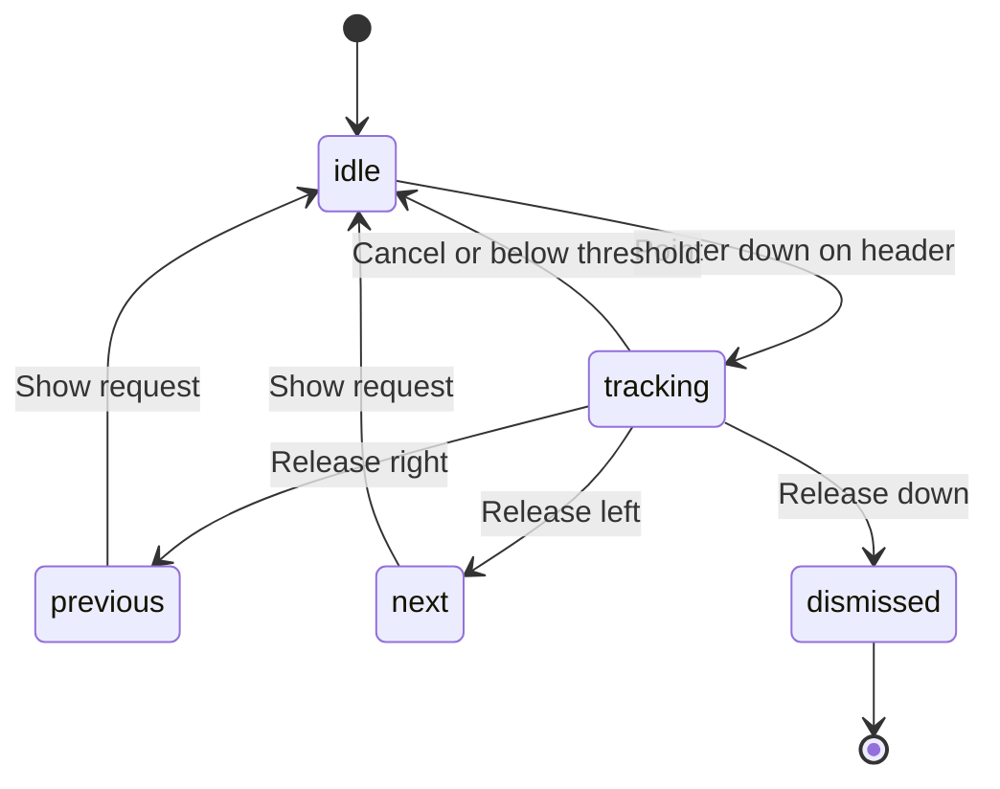

# Motion system

Instants uses native browser scrolling plus CSS transitions and keyframes. The goal is responsive, familiar feedback with small reusable pieces. The easing curves approximate a spring-like feel; this is not a physical spring solver or a reproduction of any proprietary app's motion engine.

## Shared tokens

`config/motion.json` is the source of truth. `lib/motion-tokens.ts` generates CSS custom properties, `lib/motion-core.mjs` holds pure gesture rules, and `lib/motion.ts` exposes the shared values and React helpers. Components and CSS use them for consistent behavior.

| Duration   | Default | Use                          |
| ---------- | ------- | ---------------------------- |
| Press      | 120 ms  | Short interaction feedback   |
| Standard   | 240 ms  | Routine state changes        |
| Navigation | 320 ms  | View and navigation feedback |
| Sheet      | 360 ms  | Overlay movement             |
| Like       | 650 ms  | Like burst feedback          |

The standard easing is `cubic-bezier(.2, .8, .2, 1)` and the spring-style easing is `cubic-bezier(.22, 1, .36, 1)`. The default horizontal gesture threshold is 44 CSS pixels; the downward dismissal threshold is 96 CSS pixels. These are gesture decision distances, not scroll momentum settings.

## Scroll ownership

The browser owns page scrolling from touch, trackpad, and wheel input. There is no animation-frame loop that converts wheel movement into synthetic page movement. Momentum, overscroll, and scroll-snap feel can therefore differ across operating systems and browsers.

Switching app views saves and restores their scroll position during the session. Repeating Home can scroll to the top. Programmatic movement uses smooth behavior when appropriate and immediate movement when reduced motion is requested. Position restoration should preserve reading context rather than animate a long trip through previously viewed content.

## Photo carousels

`components/motion/carousel.tsx` is the reusable native horizontal scroll-snap primitive. It supports touch swiping, mouse dragging, visible controls, and keyboard navigation. The active slide follows the scroll position so indicators remain consistent with direct manipulation.

```tsx
import { MotionCarousel } from "@/components/motion/carousel";

<MotionCarousel
  images={["/first-photo.jpg", "/second-photo.jpg"]}
  alt="Mobile dashboard designs ready for review"
  label="Work preview carousel"
  onDoubleTap={() => setLiked(true)}
/>;
```

Focus the track and use the left/right arrow keys to move between photos. Carousel CSS lives beside the component in `components/motion/carousel.css`.

Keep the vertical page scroll available while interacting with a carousel. A horizontal drag must not accidentally activate a post action. A single photo should remain usable without unnecessary carousel controls. Preserve meaningful image descriptions and labeled navigation buttons when reusing the component.

## Attention requests

The people rail opens contextual DM, comment, mention, and review requests. Swipe the request header horizontally to move between requests, or down to dismiss when the threshold is reached. Visible previous/next and close controls remain available. Small gestures and canceled pointer sequences leave the current request intact.

The conversation body retains native scrolling. Requests do not auto-advance or require holding to pause: a person can take time to read and write. Gesture handling must avoid stealing input from controls or the reply field. Opening or dismissing a request does not resolve it; reply and resolve actions belong to the [engine](engine.md).



Changes to thresholds should be exercised on an actual touch device as well as in browser automation.

## Feedback and reduced motion

Press feedback, the like burst, navigation, and overlays use shared CSS motion values. Keep feedback local to the action and avoid layout shifts. The `/motion` playground demonstrates the primitives without requiring a tour through the app.

Respect `prefers-reduced-motion`. Decorative movement and animated scrolling should reduce or stop while buttons, gestures, focus, and state changes remain functional. A reduced-motion mode is a complete interaction mode, not a reason to disable navigation or hide feedback about state.

## Verify a motion change

Run `npm run lint`, `npm run typecheck`, `npm test`, `npm run test:e2e`, and `npm run build`. Use `/motion` and the main app to check:

1. Touch and wheel scrolling remain native; a vertical gesture starting on a carousel can still move the page.
2. Carousel swipes, mouse drags, visible controls, and keyboard navigation agree on the active slide.
3. Request-header gestures choose the intended direction, respect thresholds, and preserve conversation scrolling, reply input, and visible controls.
4. Returning to a view restores reading position and repeating Home returns to the top.
5. Both themes render correctly at mobile and desktop sizes, with focus visible and reduced motion enabled.

Automated tests verify behavior, not identical momentum on every platform. Include the browser, device or viewport, input method, and reduced-motion setting in a motion bug report. A short recording often explains a timing issue better than a still image.
