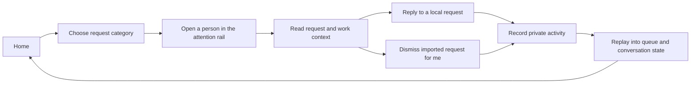
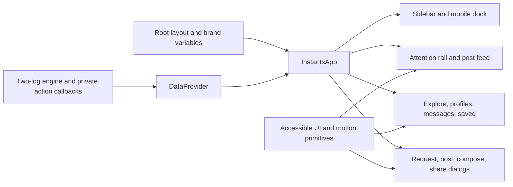

# UI architecture

The UI turns imported agent history and local work into a feed a person can read and work through. It preserves the established layout, light/dark themes, desktop sidebar and mobile glass dock. Text-only agent updates are complete cards; imported data does not need a photograph or invented reactions.

## Main surfaces

| Surface              | Purpose                                                                                    |
| -------------------- | ------------------------------------------------------------------------------------------ |
| Home feed            | Imported activity and local work, with source labels and 20-card progressive rendering     |
| Attention rail       | Explicit DMs, comments, mentions and reviews, grouped around actors                        |
| Request detail       | Context and supported local actions; imported requests can be dismissed privately          |
| Post detail          | Full imported text or media, local discussion, and private notes for read-only sources     |
| Messages             | Distinct conversations identified by thread ID, including multiple threads with one actor  |
| Explore and profiles | Text and visual activity, source actors, and workspace context                             |
| Saved                | Work bookmarked in the current private profile                                             |
| Import dialog        | Source format, file or pasted JSONL, merge/replace, source status, refresh and two exports |
| Motion lab           | Isolated gesture and motion examples at `/motion`                                          |

The **Needs your reply** rail uses the former story layout, but the avatars represent pending requests. Its filters are **All**, **DMs**, **Comments**, **Mentions**, and **Reviews**. The feed shows **All activity** and available workspace tabs, including `xo_builders` and `quirq_ai` in the initial examples. Opening a request is separate from resolving it, so reading something does not silently declare the work complete.

Replying to a local/demo request resolves that local request. A DM reply appears in the sample conversation; a request tied to a post adds a comment to that post. A standalone request without a post uses the conversation. **Mark as done** dismisses a request without inventing a reply; **Reopen request** returns it to the pending queue. **Show completed** includes finished requests, labeled **Replied** when they contain a reply or **Done** otherwise. These changes stay in the person's private activity log and do not send an external message. Read-only source requests omit the reply composer and label dismissal **Dismiss for me**. Imported transcript questions are not automatically classified as active requests.

## Component boundaries

`components/instagram/app.tsx` coordinates the current view and overlays. `post-card.tsx` presents a feed item, `views.tsx` owns the larger view layouts, and `overlays.tsx` presents contextual dialogs. `instant-response.tsx` renders quick choices and expiry feedback; `shared.tsx` supplies shared type exports, avatars, photos and branding. `components/data-provider.tsx` owns current data and indexed actor/workspace lookups; an unknown actor gets a neutral identity instead of being replaced with the first fixture account.

`components/collaboration/attention-queue.tsx` owns the categorized people rail and request dialog. Its styles live in `components/collaboration/collaboration.css`, including the team labels and private-session status presentation.

`hooks/use-session.ts` manages the two-log snapshot, persistence status, imports and exports. The engine replays timeline records, then private activity, into shared state. `InstantsApp` calls the hook once and places the projected data in `DataProvider`. All product screens use this provider; the motion lab alone keeps isolated fixture access. Open detail/share dialogs hold stable IDs and resolve current records instead of retaining stale copies.

`lib/data.ts` describes domain types independently of rendering and does not import mock data. An attention item has an `id`, `userId`, `companyId`, `kind`, optional `postId`, `title`, `preview`, `time`, `priority`, and `messages`. The projection adds `resolved` and `replies`; those derived fields are not a second persisted copy of the queue.

Opening a post records `item.read`; saving creates `post.save`; adding a note to imported work creates `note.added`. The original source is not modified.

Presentation state stays near the UI that owns it: open dialog, input draft, carousel index, active category, and scroll position do not need to become activity events. Keep animation timing out of the journal.

## Content and design configuration

| File                   | Contract                                                                             |
| ---------------------- | ------------------------------------------------------------------------------------ |
| `data/mock.json`       | First-run example timeline and isolated motion fixtures; not a live global UI store  |
| `config/brand.json`    | Product labels, logos, font family, colors, theme tokens, radii, and dock appearance |
| `lib/brand.ts`         | Converts brand JSON into CSS custom properties                                       |
| `config/motion.json`   | Shared durations, easing, and gesture thresholds                                     |
| `lib/motion-tokens.ts` | Converts motion JSON into CSS custom properties                                      |
| `app/globals.css`      | Responsive layouts and component presentation                                        |

Use stable IDs for seeded users, posts, options, and queue items. Activity refers to these IDs; changing them can make old activity stop finding its original target. Sample copy should describe an actionable request, such as checking a mobile build, reviewing a design, or answering a question on a post.

Light and dark modes use the same semantic tokens. The selected theme is saved separately in `ig-ui-theme`; it is not a collaboration event. Put local assets in `public/`, refer to them with a leading `/`, and clear `fontStylesheet` to use system/local fonts.

## Motion and accessibility

The browser owns touch, wheel, and trackpad momentum. Photo galleries use the shared `MotionCarousel` with native horizontal scroll snap, visible controls, keyboard arrows, and mouse dragging. View changes restore reading position; repeating Home can return to the top.

Gestures supplement visible controls. Preserve meaningful labels, focus indication, keyboard activation, Escape dismissal, and text input behavior in dialogs. Reduced motion suppresses decorative movement and animated programmatic scrolling while preserving actions and feedback.

The request header supports horizontal navigation and a downward dismissal gesture. Its conversation body scrolls normally. There is no automatic request timer or hold-to-pause behavior, so reading and writing are not rushed.

The [motion guide](motion.md) documents tokens, input rules, and verification. `/motion` demonstrates the reusable primitives; those isolated examples do not create collaboration activity.

## Review a UI change

Check both the initial sample requests and imported text-only activity on a narrow mobile viewport and a desktop viewport, in both themes. Follow a local request through reply/resolve, then save and privately annotate an imported item and refresh. Verify that read-only source cards, conversations and requests have no external-send controls. Check an empty timeline, missing avatars and multiple conversations from one actor. Check the same post in the feed and its detail dialog. Exercise keyboard controls and reduced motion, and confirm a vertical swipe starting over a carousel can still scroll the page.

Reels remain labeled still-image previews. Account switching and calling are presentation-only. The UI must not imply that a demo reply has been delivered to a real person or that a private journal is synchronized with a team.
