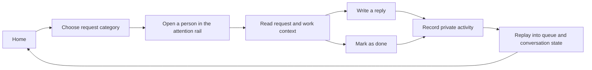
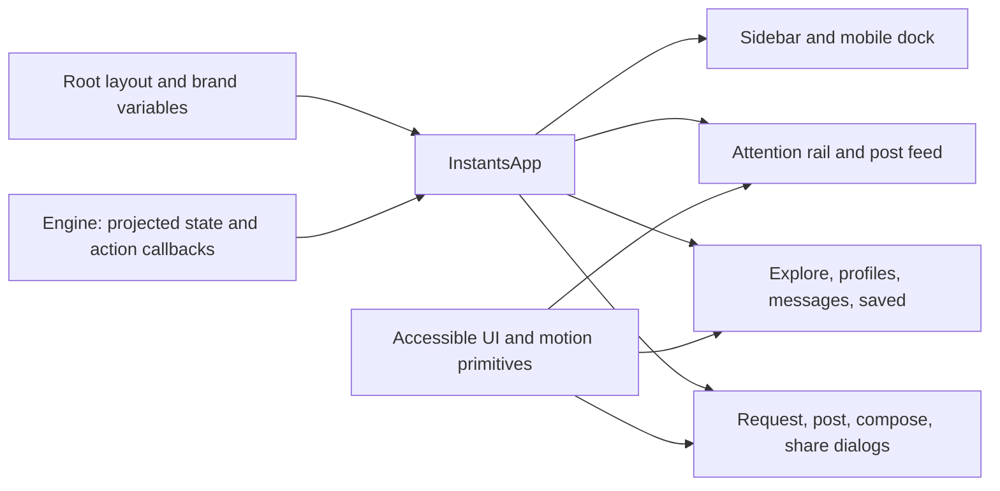

# UI architecture

The UI helps a teammate see what needs their input, open the context, and respond. It preserves the familiar photo feed, light/dark themes, desktop sidebar, and mobile glass dock while giving them a collaboration purpose.

## Main surfaces

| Surface              | Purpose                                                                                          |
| -------------------- | ------------------------------------------------------------------------------------------------ |
| Home feed            | Work from `xo_builders` and `quirq_ai`: designs, builds, tests, and decisions that need feedback |
| Attention rail       | People waiting on a DM, comment, mention, or review; filter by request category                  |
| Request detail       | The person's request, associated work where available, and a reply or resolve action             |
| Post detail          | Full work context, comments, and quick response options                                          |
| Messages             | Demo conversations with teammates, including replies and shared work                             |
| Explore and profiles | Browse sample work and team accounts                                                             |
| Saved                | Work bookmarked in the current private session                                                   |
| Motion lab           | Interactive examples of shared gestures and motion at `/motion`                                  |

The **Needs your reply** rail uses the former story layout, but the avatars represent pending requests. Its filters are **All**, **DMs**, **Comments**, **Mentions**, and **Reviews**. The feed can show **All teams**, **xo_builders**, or **quirq_ai**. Opening a request is separate from resolving it, so reading something does not silently declare the work complete.

Replying resolves the request. A DM reply appears in the sample conversation; a request tied to a post adds a comment to that post. A standalone request without a post uses the conversation. **Mark as done** dismisses a request without inventing a reply; **Reopen request** returns it to the pending queue. **Show completed** includes finished requests, labeled **Replied** when they contain a reply or **Done** otherwise. These changes stay in the person's private session and do not send an external message.

## Component boundaries

`components/instagram/app.tsx` coordinates the current view and overlays. `post-card.tsx` presents a feed item, `views.tsx` owns the larger view layouts, and `overlays.tsx` presents contextual dialogs. `instant-response.tsx` renders quick choices and expiry feedback; `shared.tsx` supplies shared data types, account lookup, avatars, photos, and branding.

`components/collaboration/attention-queue.tsx` owns the categorized people rail and request dialog. Its styles live in `components/collaboration/collaboration.css`, including the team labels and private-session status presentation.

`hooks/use-session.ts` manages persistence, while `engine/projection.ts` rebuilds shared product state. The UI receives that state and action callbacks. The same post in the feed and its detail dialog therefore uses the same comments, saved state, and response. Components should not read a session file or implement their own persistence path.

`lib/data.ts` describes the seed contracts independently of rendering. An attention item has an `id`, `userId`, `companyId`, `kind`, optional `postId`, `title`, `preview`, `time`, `priority`, and `messages`. The projection adds `resolved` and `replies`; those derived fields are not a second persisted copy of the queue.

Presentation state stays near the UI that owns it: open dialog, input draft, carousel index, active category, and scroll position do not need to become activity events. Keep animation timing out of the journal.

## Content and design configuration

| File                   | Contract                                                                             |
| ---------------------- | ------------------------------------------------------------------------------------ |
| `data/mock.json`       | Versioned sample companies, teammates, posts, messages, and attention requests       |
| `config/brand.json`    | Product labels, logos, font family, colors, theme tokens, radii, and dock appearance |
| `lib/brand.ts`         | Converts brand JSON into CSS custom properties                                       |
| `config/motion.json`   | Shared durations, easing, and gesture thresholds                                     |
| `lib/motion-tokens.ts` | Converts motion JSON into CSS custom properties                                      |
| `app/globals.css`      | Responsive layouts and component presentation                                        |

Use stable IDs for seeded users, posts, options, and queue items. Activity refers to these IDs; changing them can make old activity stop finding its original target. Sample copy should describe an actionable request, such as checking a mobile build, reviewing a design, or answering a question on a post.

Light and dark modes use the same semantic tokens. The selected theme is saved separately in `ig-ui-theme`; it is not a collaboration event. Put local assets in `public/`, refer to them with a leading `/`, and clear `fontStylesheet` to use system/local fonts.

## Motion and accessibility

The browser owns touch, wheel, and trackpad momentum. Photo galleries use the shared `MotionCarousel` with native horizontal scroll snap, visible controls, keyboard arrows, and mouse dragging. View changes restore reading position; repeating Home can return to the top.

Gestures supplement visible controls. Preserve meaningful labels, focus indication, keyboard activation, Escape dismissal, and text input behavior in dialogs. Reduced motion suppresses decorative movement and animated programmatic scrolling while preserving actions and feedback.

The request header supports horizontal navigation and a downward dismissal gesture. Its conversation body scrolls normally. There is no automatic request timer or hold-to-pause behavior, so reading and writing are not rushed.

The [motion guide](motion.md) documents tokens, input rules, and verification. `/motion` demonstrates the reusable primitives; those isolated examples do not create collaboration activity.

## Review a UI change

Check both companies' sample requests on a narrow mobile viewport and a desktop viewport, in both themes. Follow a request through reply or resolve and refresh to verify its private state. Check the same post in the feed and its detail dialog. Exercise keyboard controls and reduced motion, and confirm a vertical swipe starting over a carousel can still scroll the page.

Reels remain labeled still-image previews. Account switching and calling are presentation-only. The UI must not imply that a demo reply has been delivered to a real person or that a private journal is synchronized with a team.
